## 简介([官网](https://www.supermap.com))

超图软件研发的大型 GIS  基础软件系列—— **SuperMap  GIS**，是**二三维一体化的空间数据采集、存储、管理、分析、处理、制图与可视化的工具软件，更是赋能各行业应用系统的软件开发平台**。

### 云端一体化

历经二十余年的技术沉淀，超图软件构建了云端一体化的 SuperMap GIS 产品体系，包含**云 GIS 服务器、边缘 GIS 服务器、端 GIS 等多种软件产品，此外还通过SuperMap Online产品提供在线GIS服务**。

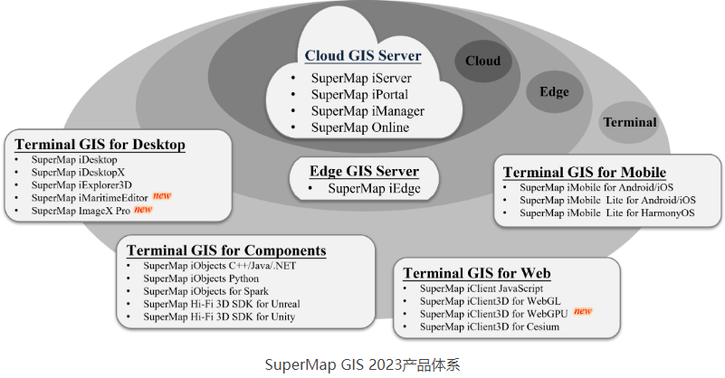

### 云 GIS 平台软件

SuperMap GIS 产品系列中的云GIS平台软件包括 **SuperMap iServer、SuperMap iPortal、SuperMap iManager。**

- iServer -- 服务器 GIS 软件开发平台

> iServer提供全功能的GIS 服务发布、管理与聚合能力，并支持多层次的扩展开发。
>
> 提供强大的空间大数据、GeoAI 、空间区块链和三维等相关的 Web 服务，支持海量的矢量、栅格数据“免切片”发布。
>
> 深度融合微服务、容器化等，提供多种SDK，助力构建微服务架构的云原生GIS 应用系统。

- iPortal --  GIS 门户软件平台

> iPortal集 GIS 资源整合、搜索、共享和管理于一体，具备零代码快速建站、多源异构服务注册、多源服务权限控制等能力。
>
> 提供丰富的 Web 端应用，可以进行专题图制作、空间要素编辑、分布式空间分析、三维可视化、大屏创建与展示等操作。
>
> 作为云边端一体化 GIS 平台的用户中心、资源中心、应用中心，可快速构建 GIS 门户站点。

-  iManager -- GIS 运维管理中心

> 可用于应用服务管理、基础设施管理、大数据管理。
>
> 提供基于容器技术的 Kubernetes 解决方案，可一键创建基于云原生 GIS 技术的大数据、AI 与三维 GIS 系统。
>
> 可监控多个 GIS 数据存储、计算与服务节点或其它 Web 站点，监控硬件资源占用、地图访问热点、节点健康状态等指标，实现GIS 系统的一体化运维管理。
>
> 可管理运维GIS 云原生系统，实现细粒度的动态伸缩和灵活部署。

## iServer 

**SuperMap iServer 是基于高性能跨平台GIS内核、分布式、可扩展的服务器GIS软件开发平台，该产品
通过服务的方式，面向网络客户端提供与专业GIS桌面产品相同功能的 GIS 服务；能够管理、发布和无缝聚
合多源服务，包括REST服务、OGC服务（WMS、WMTS、WFS、WCS、WPS、CSW）等；支持多种类型
客户端访问；支持分布式环境下的数据管理、编辑和分析等GIS功能；提供从客户端到服务器端的多层次扩展
的面向服务GIS的开发框架。**

[**iServer产品自述**](./files/SuperMap_iServer_11i(2023)_Readme_Windows_CHS.pdf)

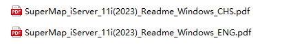

产品包（目录结构）

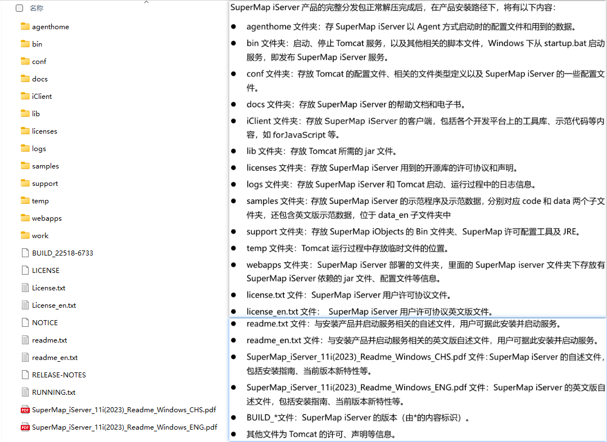

[帮助文档](./files/SuperMapiServer11i(2023)_ZH.chm)

启动与关闭

在【SuperMap iServer安装目录】**\bin**下，运行`startup.bat`即可启动 **SuperMap iServer 11i(2023)服
务器**，运行`shutdown.bat`可以停止服务器。

> supermap-iserver-11.1.1a-windows-x64\bin     启动与关闭本地服务   

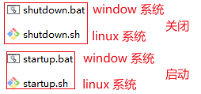

访问服务

SuperMap iServer 服务器启动后，会自动发布默认的示例服务，SuperMapiServer默认的**端口号**为
**8090**。通过`localhost:8090/iserver/` 即可访问 SuperMap iServer 服务的首页。

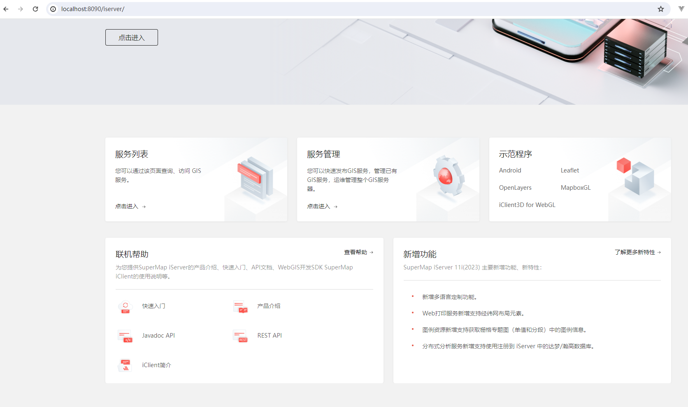

许可中心

> supermap-iserver-11.1.1a-windows-x64\support\SuperMapLicenseCenter

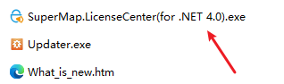

[SuperMap Online-全面的在线GIS数据与应用平台](https://www.supermapol.com/)

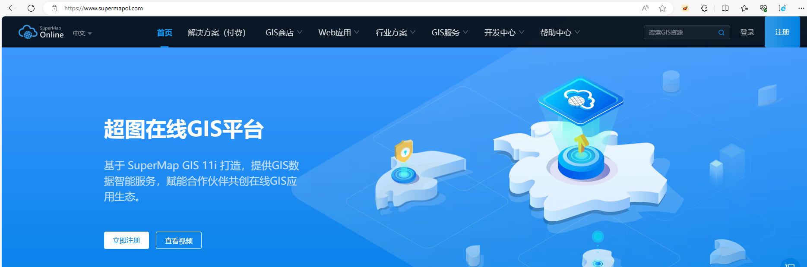

[GIS小工具](https://www.supermapol.com/gistools/home)

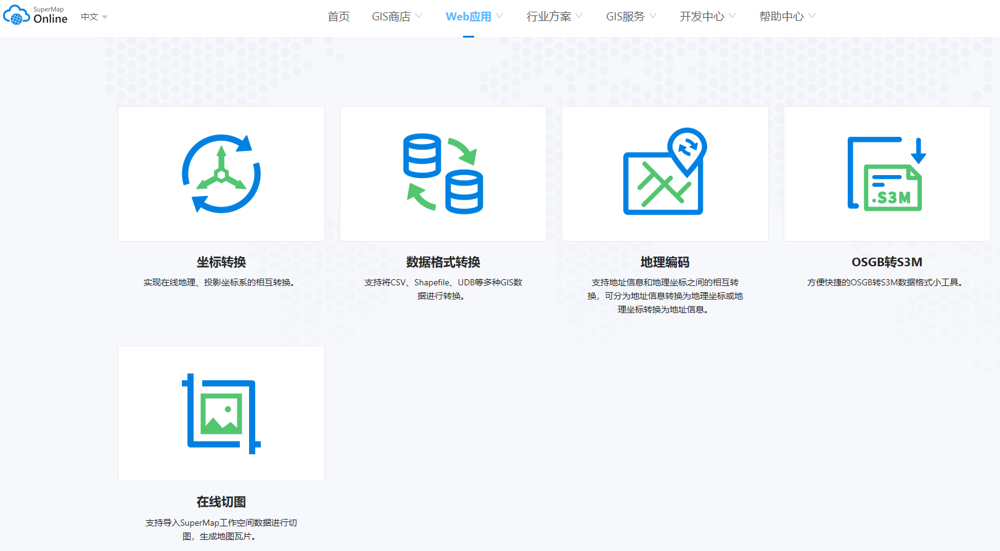

## iClient

多端跨平台开发

> supermap-iserver-11.1.1a-windows-x64\iClient

### iClient for JavaScript

2.1.1 目录结构

> supermap-iserver-11.1.1a-windows-x64\iClient\forJavaScript

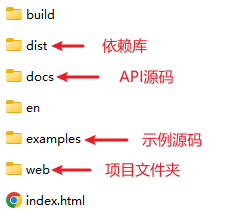

2.1.1.1 支持多种 javascript 库

> supermap-iserver-11.1.1a-windows-x64\iClient\forJavaScript\dist
>
> 地图开发库支持：Leaflet、OpenLayers、MapboxGL-JS、MapLibreGL-JS、iClient Classic

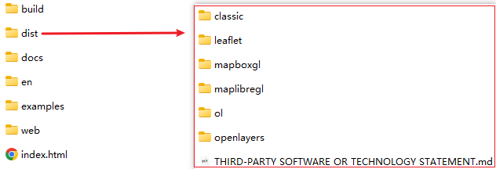

2.1.1.1.1 开发依赖（以leaflet 为例）

> supermap-iserver-11.1.1a-windows-x64\iClient\forJavaScript\dist\leaflet

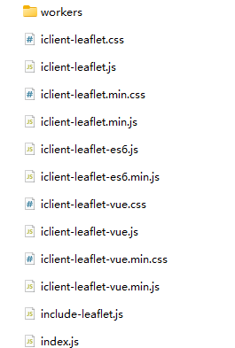

2.1.1.2 官方 API 文档源码

> supermap-iserver-11.1.1a-windows-x64\iClient\forJavaScript\docs

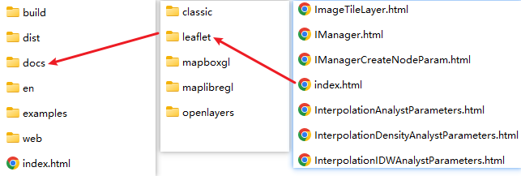

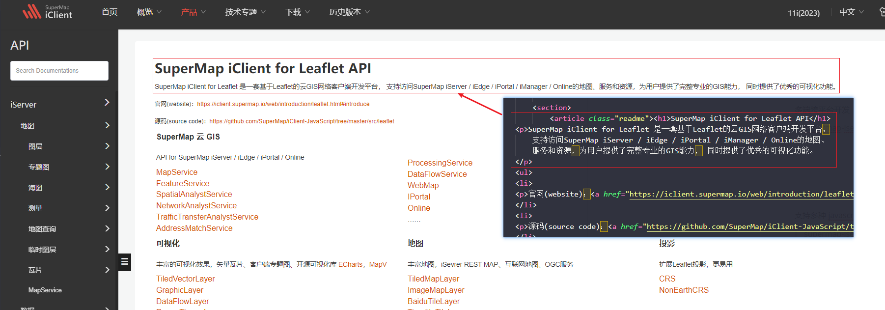

2.1.1.3 官方示例源码

> supermap-iserver-11.1.1a-windows-x64\iClient\forJavaScript\examples

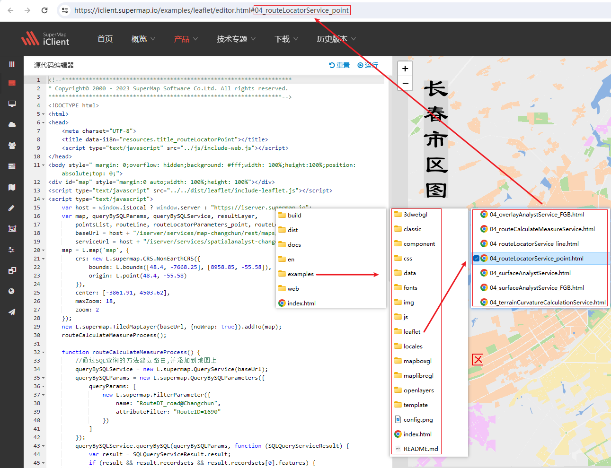

2.1.1.4 项目文件

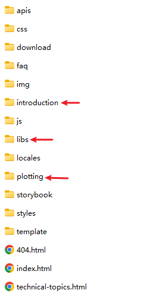

#### iClient for Leaflet

 第三方依赖库

> supermap-iserver-11.1.1a-windows-x64\iClient\forJavaScript\web\libs    

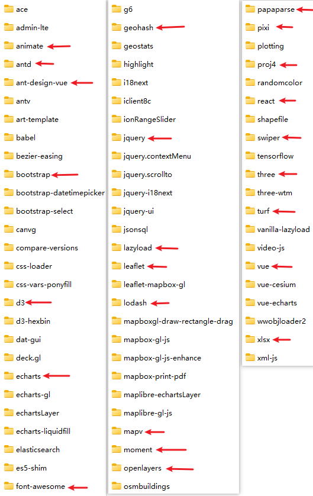

####  iClient3D for Cesium

> supermap-iserver-11.1.1a-windows-x64\iClient\for3D\webgl\zh 

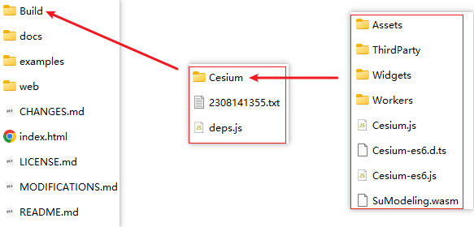

## iDesktop

桌面GIS软件平台，具备二三维一体化的数据管理与处理、编辑、制图、分析、二三维标绘等功能，支持海图， 
支持在线地图服务访问及云端资源协同共享，可用于空间数据的生产、加工、分析和行业应用系统快速定制开发。